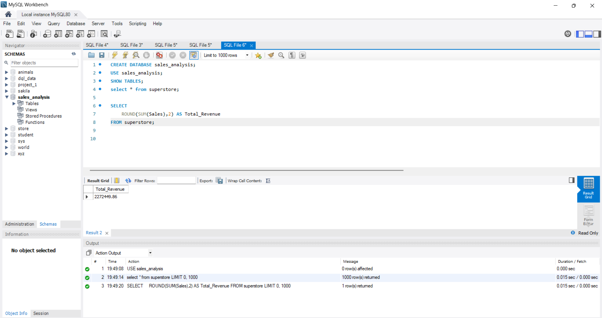
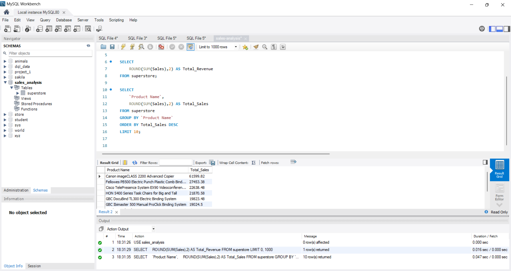
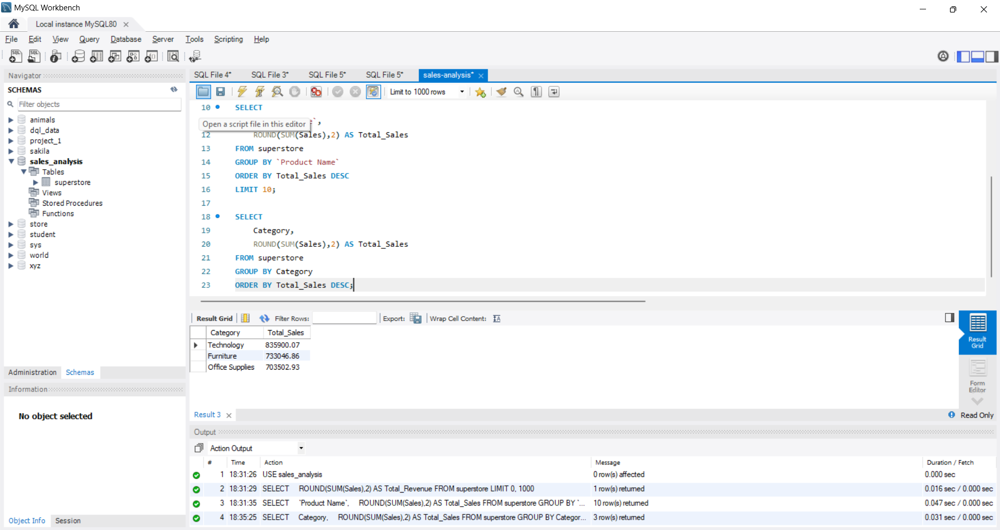
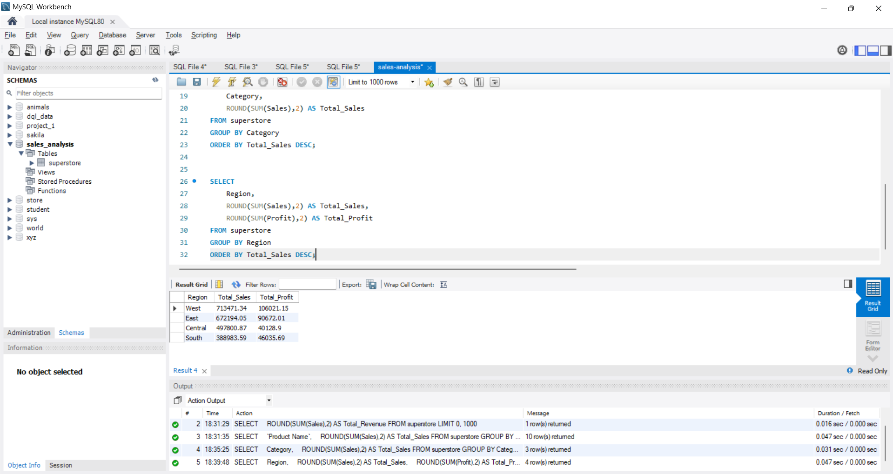
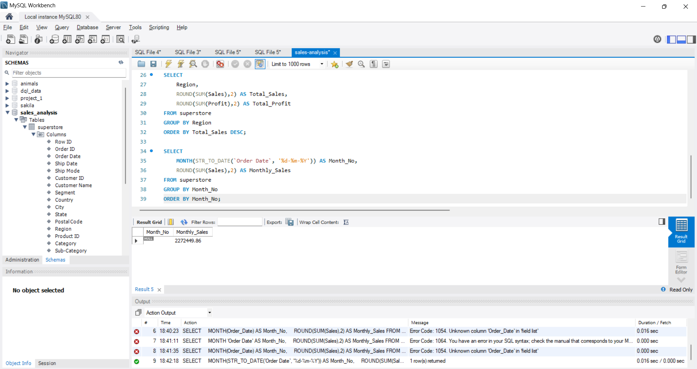

# 📊 SQL Sales Analysis Project

An SQL-based data analysis project performed on the Sample Superstore dataset to extract meaningful business insights using MySQL.

---

## 🚀 Project Overview

This project focuses on analyzing sales, profit, customer behavior, and regional performance using SQL queries. The goal is to demonstrate practical SQL skills used in real-world business analysis.

---

## 🛠️ Tools & Technologies

- MySQL
- SQL
- Sample Superstore Dataset
- GitHub

---

## 📚 SQL Skills Demonstrated

- Aggregate Functions (`SUM`, `AVG`, `ROUND`)
- GROUP BY
- ORDER BY
- LIMIT
- Date Functions
- Business KPI Analysis
- Sales & Profit Analysis

---

## 📈 Business Questions Solved

### 1. Total Revenue Generated
```sql
SELECT ROUND(SUM(Sales),2) AS Total_Revenue
FROM superstore;
```

### 2. Top 10 Products by Sales
```sql
SELECT
    `Product Name`,
    ROUND(SUM(Sales),2) AS Total_Sales
FROM superstore
GROUP BY `Product Name`
ORDER BY Total_Sales DESC
LIMIT 10;
```

### 3. Sales by Category
```sql
SELECT
    Category,
    ROUND(SUM(Sales),2) AS Total_Sales
FROM superstore
GROUP BY Category
ORDER BY Total_Sales DESC;
```

### 4. Regional Performance
```sql
SELECT
    Region,
    ROUND(SUM(Sales),2) AS Total_Sales,
    ROUND(SUM(Profit),2) AS Total_Profit
FROM superstore
GROUP BY Region
ORDER BY Total_Sales DESC;
```

### 5. Top Customers by Sales
```sql
SELECT
    `Customer Name`,
    ROUND(SUM(Sales),2) AS Total_Sales
FROM superstore
GROUP BY `Customer Name`
ORDER BY Total_Sales DESC
LIMIT 10;
```

---

# 📷 Project Screenshots

## Total Revenue


---

## Top 10 Products


---

## Sales by Category


---

## Regional Performance


---

## Monthly Sales Trend


---

# 🎯 Key Insights

- Technology products generated the highest sales revenue.
- Certain regions consistently outperformed others in both sales and profitability.
- A small number of products contributed significantly to overall revenue.
- Monthly sales trends highlighted variations in customer demand.
- Customer purchasing behavior showed concentration among top buyers.

---

# 📂 Repository Structure

```text
sql-sales-analysis/
│
├── README.md
├── queries.sql
├── Sample - Superstore.csv
│
└── screenshots/
    ├── total_revenue.png
    ├── top_products.png
    ├── sales_by_category.png
    ├── regional_performance.png
    └── monthly_sales_trend.png
```

---

# 👨‍💻 Author

## Aryan Prasad

Aspiring Data Analyst | Power BI | SQL | Python | Excel

🔗 GitHub: https://github.com/thearyanprasad

🔗 Portfolio: https://thearyanprasad.github.io

🔗 LinkedIn: https://www.linkedin.com/in/prasadaryan9354

---

⭐ If you found this project useful, consider giving it a star.
